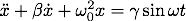
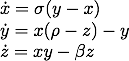

# DynamicalSystems.jl

A collection of Julia functions that produce the systems of ODEs for various dynamical systems.
The results of these functions are designed to be used as inputs for the [RungeKutta.jl](https://github.com/timothyrenner/RungeKutta.jl) package.

***NOTE:*** Requires Julia 0.4.

## Setup

No dependencies are required, just install with

```julia
Pkg.clone("git://github.com/timothyrenner/DynamicalSystems.jl.git");
```

You might also want the Runge-Kutta solver package.

```julia
Pkg.clone("git://github.com/timothyrenner/RungeKutta.jl.git");
```

## Functions

Each of the functions returns an Array of functions of the form

	f[i](t,x) ==> x[i]

where `i` is the index, `t` is the time, and `x` is the point (one dimensional Array).
Each of these functions returns the ith component of the _next_ point in the solution to the ODE, which is precisely the format a Runge-Kutta method uses to solve it.

There are currently two functions implemented in this package.

### `harmonicOscillator`

The harmonic oscillator equation is



The function signature is

```julia
harmonicOscillator(omega0; beta=0.0, gamma=0.0, omega=1.0)
```

where `beta` is the damping term, `omega0` is the base frequency, `gamma` is the driving amplitude, and `omega` is the driving frequency.
This harmonic oscillator is defined with a sinusoidal driving force.

Read more about the harmonic oscillator [here](http://en.wikipedia.org/wiki/Harmonic_oscillator).

### `duffingOscillator`

The duffing oscillator equation is


The function signature is

```julia
duffingOscillator(delta, gamma; alpha=1.0, beta=-1.0, omega=1.0)
 ```
 
 where `delta` is the damping term, `gamma` is the driving amplitude, `alpha` is the stiffness, `beta` is the restoring force non-linearity, and `omega` is the driving force frequency.
 
 Read more about the Duffing oscillator [here](http://en.wikipedia.org/wiki/Duffing_equation). 
 
### `lorenzAttractor`

The Lorenz attractor system of equations is



The function signature is

```julia
lorenzAttractor(sigma, rho, beta)
```

where `sigma`, `rho`, and `beta` are the corresponding terms in the system of equations.

Read more about the Lorenz attractor [here](http://en.wikipedia.org/wiki/Lorenz_system).